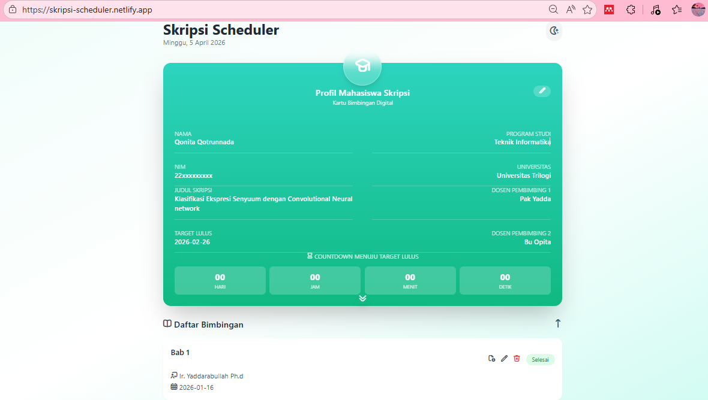
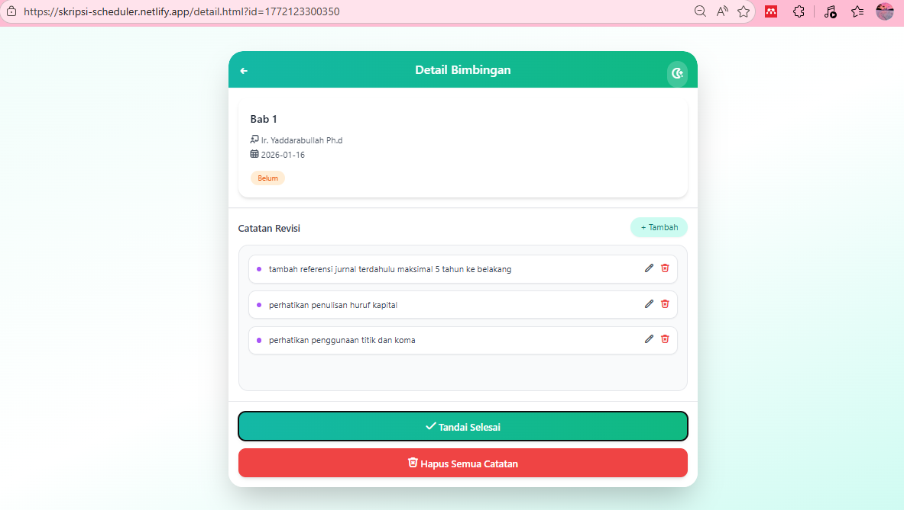

# 🎓 Skripsi Scheduler

A web-based thesis scheduler built with HTML, CSS, and Tailwind CSS to help students manage supervision sessions, revision notes, and deadlines in one organized platform.

## 🚀 Live Demo

👉 https://skripsi-scheduler.netlify.app/

## 📌 Background

This project was inspired by my personal experience as a thesis student struggling to keep supervision schedules, revision notes, and deadlines organized.

## ✨ Features

* 📄 Thesis profile management (CRUD)
* ⏳ Graduation countdown tracker
* 📅 Supervision schedule management (add, edit, delete)
* 🔃 Sorting schedules (newest & oldest)
* 📝 Detailed meeting notes for revision tracking
* ✏️ Full CRUD for revision notes

## 🛠️ Tech Stack

* HTML
* CSS
* Tailwind CSS
* Netlify (Deployment)

## 📸 Preview
### Home Page

### Detail Page

## 📈 Future Improvements

* Authentication system
* Multi-user support
* Reminder & notification system

## 👩‍💻 Author

Made with ❤️ by nadaqqn
